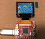

# Pocketscreen Word Watch

Install in Arduino IDE:  
RTCZero and Time 
Rename in the Time library Time.h in XTime.h to avoid compiler errors 
Replace the PS_Fonts.h in the ...\Arduino\libraries\PocketScreen\ folder 
I am still studying how to add my own monospaced font to the program. 
The W and I were changed to become monospaced. The rest was monospaced 

This word watch software is a adaption of the word clock with white LEDs or color 
RGBW LEDs that can be found in my repository. 
It was relative easy to adapt the software for thew pocket screen. 
The Pocketscreen uses the RTC from the SAMD21 microcontroller for time keeping. 
 
Things to be done: 
- Get the time from and NTP server and/or make a web server page for this clock 
- Get my own font in the compilation. 
