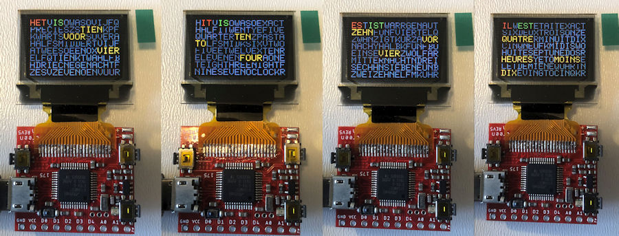

# PocketScreen Word Watch

The software in still in developing state but V009 and V012 are stable.
To compile the source:
- Install in Arduino IDE: "RTCZero" and "Time" libraries 
- Rename in the Time library folder ...\Arduino\libraries\Time\ Time.h in XTime.h to avoid compiler errors 

I changed the PocketScreen font slightly. 
The W and I were altered to become monospaced. The rest was already monospaced 
This font is stored in the PS_MSFonts.h 

This word watch software is a adaption of the word clock with white LEDs or  
color RGBW-LEDs that can be found in my repository. 
It was relative easy to adapt the software for the pocket screen. 
I used the same structure with the same subroutines as used for LED-strips 
to address the OLED-display. 
The PocketScreen Word watch uses the RTC from the SAMD21 microcontroller for time keeping. 
With the buttons time can be changed 
One can choose between four languages as shown above; NL, UK, DE and FR 
and several colour palette options 

Things to be done: 
- Get the time from a NTP server  
- or make a web server page for this clock 
- Get the power from a Lipo battery and reduce the power need

