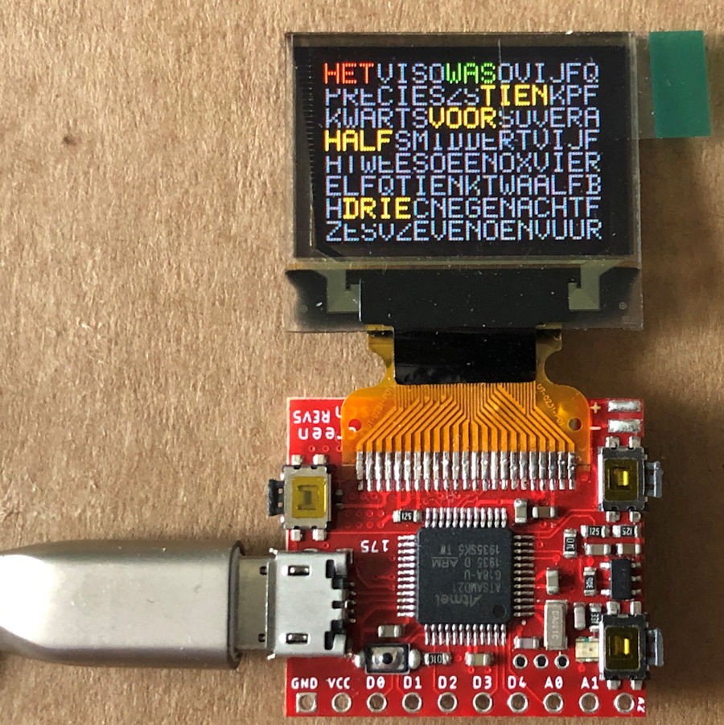

# Pocketscreen Word Watch

The software in still in developing state but V009 and V012 are stable.
To compile the source:
- Install in Arduino IDE: RTCZero and Time libraries 
- Rename in the Time library ...\Arduino\libraries\Time\ Time.h in XTime.h to avoid compiler errors 
- Replace the PS_Fonts.h in the ...\Arduino\libraries\PocketScreen\ folder 
I am still studying how to add my own monospaced font to the program. 
The W and I were changed to become monospaced. The rest was already monospaced 

This word watch software is a adaption of the word clock with white LEDs or  
color RGBW-LEDs that can be found in my repository. 
It was relative easy to adapt the software for thew pocket screen. 
The Pocketscreen Word watch uses the RTC from the SAMD21 microcontroller for time keeping. 
With the buttons time can be changed 
Things to be done: 
Done V012 - Get the other languages UK, DE and FR running 
- Get several colour palette options running 
- Get the time from and NTP server  
- Make a web server page for this clock 
- Get my own font in the compilation 
- Get the power from a Lipo battery and reduce the power need

